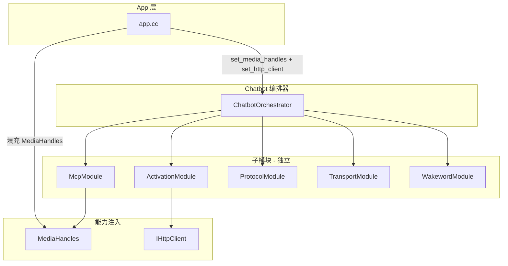

# Chatbot 架构重设计 v2

## 一、现状与问题

### 1.1 当前结构

```
chatbot/                    # 新版本（MediaHandles）
├── chatbot.hpp/cc          # 编排器，set_media_handles
├── mcp/mcp.hpp/cc          # McpServer 核心
├── mcp/mcp_tool/           # MediaHandles + register_tools
├── activation/
├── protocol_handle/
└── wakeword/

chatbot copy/               # 旧版本（AudioSystem/VideoSystem 直接依赖）
├── chatbot.hpp/cc          # 强依赖 AudioSystem*, VideoSystem*
├── mcp/                    # 与 chatbot/ 相同
└── ...
```

### 1.2 问题

| 问题 | 表现 |
|------|------|
| **双份代码** | chatbot 与 chatbot copy 并存，维护成本高 |
| **App 与 Chatbot 不同步** | app.cc 调用 setAudioService/setVideoService，chatbot 已改为 set_media_handles |
| **职责混杂** | Chatbot 同时负责激活、MCP、协议、WebSocket、唤醒词、音频控制 |
| **依赖方向混乱** | chatbot copy 依赖具体媒体类型，难以替换实现 |

---

## 二、新架构设计

### 2.1 设计原则

1. **单一职责**：每个模块只做一件事
2. **依赖倒置**：通过回调注入能力，不依赖具体类型
3. **可插拔**：模块可按配置启用/禁用
4. **单源**：删除 copy 目录，只保留一套实现

### 2.2 模块划分



### 2.3 新目录结构

```
chatbot/
├── chatbot.hpp              # ChatbotOrchestrator 公开 API
├── chatbot.cc               # 编排实现
├── config.hpp               # ChatbotConfig（可选，可合并到 chatbot.hpp）
├── activation/              # 设备激活（保持）
├── mcp/
│   ├── mcp.hpp              # McpServer、Property、PropertyList、McpTool
│   ├── mcp.cc               # MCP 协议实现
│   └── tools/
│       ├── tools.hpp        # MediaHandles、register_tools 声明
│       └── tools.cc         # 工具注册实现
├── protocol/                # 协议解析（原 protocol_handle）
│   ├── protocol.hpp
│   └── protocol.cc
├── transport/               # 传输层抽象（可选，当前直接用 websocket）
│   └── (使用现有 protocol/websocket)
└── wakeword/                # 唤醒词（保持）
```

**说明**：`protocol_handle` 可保留原名，仅作目录整理；`mcp_tool` 改名为 `tools` 更简洁。

### 2.4 数据流

```
[唤醒词] → Chatbot 状态 CONNECTING
         → 创建 WebSocket，连接 AI 服务器
         → 状态 LISTENING
         → 协议解析 (Hello/Listen/STT/LLM/TTS/MCP)
         → MCP 调用 → MediaHandles 回调 → AudioDrv/CameraDrv
         → TTS 播放 → MediaHandles.push_tts / 或直接操作 playback
```

### 2.5 MediaHandles 设计（保持不变）

```cpp
struct MediaHandles {
    std::function<void(int)> set_volume;
    std::function<int()>     get_volume;
    std::function<void(const std::string&, const std::string&)> set_explain_url;
    std::function<std::string(const std::string&)>             explain_image;
    std::function<bool(const std::string&, std::function<void(bool)>)> save_photo;
    std::function<bool(const std::string&, int)> start_record;
    std::function<void()>    stop_record;
    std::function<bool()>   is_recording;
    std::function<bool()>   is_running;
    std::function<bool()>   start_stream;
    std::function<void()>   stop_stream;
};
```

空回调 = 跳过对应工具，不报错。

---

## 三、实施步骤

### 阶段 1：清理与统一

1. **删除 `chatbot copy/` 整个目录**
2. **确认 `mcp/` 无 copy**（当前 mcp 与 mcp copy 内容相同，无 mcp copy 目录）
3. **统一 mcp_tool 命名**：保留 `mcp_tool` 或改为 `tools`（可选）

### 阶段 2：更新 App 集成

1. **修改 app.cc initChatbot()**：
   - 创建 `MediaHandles`，从 `audio_drv_`、`camera_drv_` 填充回调
   - 调用 `chatbot_->set_media_handles(handles)`
   - 调用 `chatbot_->set_http_client(http_svc_.get())`
   - 删除 `setAudioService`、`setVideoService`、`setNetworkService`、`setDeviceInfo`、`setWebSocketFactory`

2. **Chatbot 内部**：device_id/client_id 通过 mac/uuid 在 init 内获取，无需 DeviceInfo 注入

### 阶段 3：Chatbot 精简

1. **chatbot.hpp**：只保留
   - ChatbotConfig
   - ChatbotState / ChatbotError
   - ChatbotSystem：set_media_handles, set_http_client, init, deinit, get_state, is_ready, disconnect
   - state_to_string, error_to_string

2. **chatbot.cc**：编排逻辑
   - init：设备 ID → 激活 → MCP → 协议 → WebSocket → 唤醒词
   - deinit：逆序释放
   - 不包含 TTS 播放、AI 流等运行时逻辑（若当前有，需迁移到协议回调或独立模块）

### 阶段 4：MCP 保持

- mcp.hpp / mcp.cc：保持现有实现
- mcp_tool：MediaHandles + register_tools，保持回调式

---

## 四、文件变更清单

| 操作 | 路径 |
|------|------|
| 删除 | `app/chatbot copy/` 整个目录 |
| 保留 | `app/chatbot/chatbot.hpp`、`chatbot.cc` |
| 保留 | `app/chatbot/mcp/mcp.hpp`、`mcp.cc` |
| 保留 | `app/chatbot/mcp/mcp_tool/mcp_tool.hpp`、`mcp_tool.cc` |
| 修改 | `app/app.cc`：initChatbot 改为 MediaHandles 注入 |

---

## 五、App 集成代码示例

```cpp
// app.cc initChatbot()

chatbot::ChatbotConfig cfg;
chatbot_ = std::make_unique<chatbot::ChatbotSystem>(cfg);

// 填充 MediaHandles
mcp::mcp_tool::MediaHandles handles;
if (audio_drv_ && audio_drv_->is_init()) {
    handles.set_volume = [this](int v) {
        audio_drv_->playback().set_volume(static_cast<uint8_t>(v));
    };
    handles.get_volume = [this]() {
        return static_cast<int>(audio_drv_->playback().volume());
    };
}
if (camera_drv_ && camera_drv_->is_init()) {
    handles.set_explain_url = [this](const std::string& u, const std::string& t) {
        camera_drv_->set_explain_url(u, t);
    };
    handles.explain_image = [this](const std::string& q) {
        return camera_drv_->explain_image(q);
    };
    handles.save_photo = [this](const std::string& path, std::function<void(bool)> cb) {
        camera_drv_->jpeg().save(path, [cb](const std::string&, camera::Error e) {
            if (cb) cb(e == camera::Error::OK);
        });
        return true;
    };
    handles.start_record = [this](const std::string& path, int dur) {
        return camera_drv_->recorder().start(path, dur) == camera::Error::OK;
    };
    handles.stop_record = [this]() { camera_drv_->recorder().stop(); };
    handles.is_recording = [this]() { return camera_drv_->recorder().is_recording(); };
    handles.is_running = [this]() { return camera_drv_->is_running(); };
    handles.start_stream = [this]() { return camera_drv_->start() == camera::Error::OK; };
    handles.stop_stream = [this]() { camera_drv_->stop(); };
}

chatbot_->set_media_handles(handles);
chatbot_->set_http_client(http_svc_.get());

chatbot::ChatbotError err = chatbot_->init();
if (err != chatbot::ChatbotError::NONE) {
    LOG_ERROR(LOG_TAG, "Chatbot init failed");
    return false;
}
```

---

## 六、总结

| 项目 | 变更 |
|------|------|
| 架构 | 编排器 + 回调注入，无媒体类型依赖 |
| 代码 | 删除 chatbot copy，保留单一实现 |
| App | 使用 MediaHandles 注入，移除 setXxxService |
| MCP | 保持 McpServer + MediaHandles 工具注册 |
